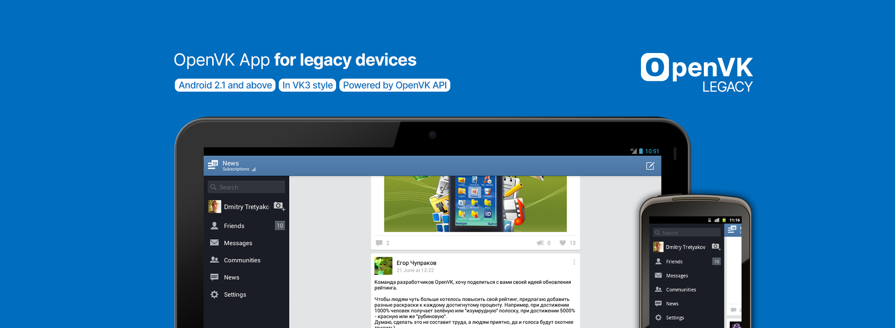

# OpenVK Legacy для Android

_[English](README.md)_

> [!WARNING]
> OpenVK является любительской разработкой и никак не связан с ВКонтакте и компанией ООО "ВК".

Автор: [Дмитрий Третьяков (Tinelix)](https://github.com/tretdm)

**OpenVK Legacy** - мобильный клиент для ретро-устройств, работающие на Android 2.1 Eclair и выше.\
_Работает на OpenVK API._

Мы будем рады принять ваши сообщения об ошибках [в нашем баг-трекере](https://github.com/openvk/mobile-android-legacy/projects/1).

## Скачать APK
* **через F-Droid**
  * **[repo.openvk.uk](https://repo.openvk.uk/repo/)** (намного быстрее, зеркало ~~[без TLS](http://repo.openvk.co/repo/)~~ не оплачено)
  * [f-droid.org](https://f-droid.org/packages/uk.openvk.android.legacy/)
  * [izzysoft.de](https://apt.izzysoft.de/fdroid/index/apk/uk.openvk.android.legacy)
  * [tinelix.ru](https://repo.tinelix.ru)
* **через [Telegram-канал](https://t.me/+nPLHBZqAsFlhYmIy)**
* **через [страницу релизов](https://github.com/openvk/mobile-android-legacy/releases/latest)**
* **через [NashStore](https://store.nashstore.ru/store/637cc36cfb3ed38835524503)** _(а почему бы и нет?)_
* **через [Trashbox](https://trashbox.ru/topics/164477/openvk-legacy)**
* **через [4PDA](https://4pda.to/forum/index.php?showtopic=1057695)**

## Сборка
Мы советуем открывать проект в [Android Studio 3.1.2](https://developer.android.com/studio/archive) вместе с уже установленным Java 7 для идеальной поддержки библиотек, разработанные для Android 2.1 Eclair и выше.

**ВНИМАНИЕ!** После возникновения ошибки `java.util.zip.ZipException: invalid entry compressed size (expected [m] but got [n] bytes)` в задаче `:[package_name]:mockableAndroidJar`, при использовании Android SDK Build-tools 28 и выше необходимо очистить проект (Clean Project).

## Используемые библиотеки
1. [Android Support Library v24 for 1.6+](https://developer.android.com/topic/libraries/support-library) (Apache License 2.0)
2. [HttpUrlWrapper](https://github.com/tinelix/httpurlwrapper) (Apache License 2.0)
3. [PhotoView 1.2.5](https://github.com/Baseflow/PhotoView/tree/v1.2.5) (Apache License 2.0)
4. [SlidingMenu with Android 10+ patch](https://github.com/tinelix/SlidingMenu) (Apache License 2.0)
5. [OkHttp 3.8.0](https://square.github.io/okhttp/) (Apache License 2.0)
6. [Twemojicon (Emojicon с пакетом Twemoji)](https://github.com/rockerhieu/emojicon/tree/1.2) (Apache License 2.0)
7. [FFmpeg 2.2.4](https://github.com/tinelix/ffmpeg-android-builder/tree/ffmpeg-2.2.4) вместе со [сборщиком](https://github.com/tinelix/ffmpeg-android-builder/tree/42c67d80bc924c9709a7648e2d12f04ddf43b32b) (LGPLv3.0)
8. [ijkplayer 0.8.2](https://github.com/bilibili/ijkplayer/tree/k0.6.2) (LGPL 2.1+)
9. [Retro-ActionBar](https://github.com/tinelix/retro-actionbar) (Apache License 2.0)
10. [Retro-PopupMenu](https://github.com/tinelix/retro-popupmenu) (Apache License 2.0)
11. [SystemBarTint](https://github.com/jgilfelt/SystemBarTint) (Apache License 2.0)
12. [Модификация SwipeRefreshLayout с классическим PTR](https://github.com/xyxyLiu/SwipeRefreshLayout) (Apache License 2.0)
13. [android-i18n-plurals](https://github.com/populov/android-i18n-plurals) (X11 License)
14. [Application Crash Reports 4.6.0](https://github.com/ACRA/acra/tree/acra-4.6.0) (Apache License 2.0)
15. [Universal Image Loader](https://github.com/nostra13/Android-Universal-Image-Loader/tree/v1.9.5) (Apache License 2.0)
16. [NineOldAndroids animation API](https://github.com/JakeWharton/NineOldAndroids) (Apache License 2.0)

## Лицензия OpenVK Legacy
[GNU Affero GPL v3.0](COPYING) или более поздней версии.

## Ссылки
[Документация по OpenVK API](https://docs.openvk.su/openvk_engine/api/description/)\
[OpenVK Mobile](https://openvk.uk/app)

